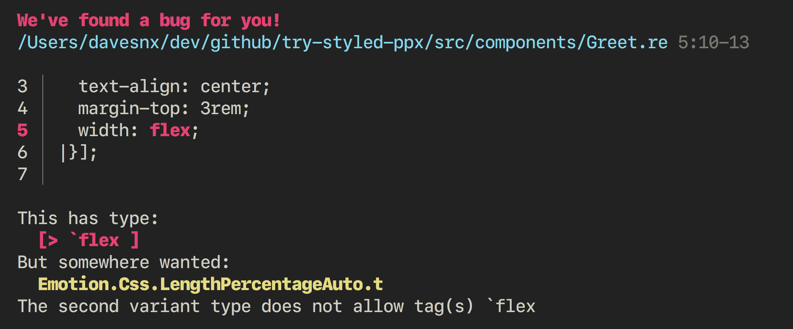

<h1> styled-ppx <a href="https://github.com/davesnx/styled-ppx/actions"></a></h1>

**styled-ppx** is the [ppx](https://victor.darvariu.me/jekyll/update/2018/06/19/ppx-tutorial.html) that enables *css-in-reason*.
Build on top of [emotion](https://emotion.sh), it allows you to style apps safe, quickly, performant and as you always done it.


Allows you to create **React Components** with type-safe CSS style definitions that don't rely on a specific [DSL](https://en.wikipedia.org/wiki/Domain-specific_language) and great error messages:



> **BETA**: This ppx is in an early stage ⚠️. Meaning that it doesn't support full functionality as [emotion](https://emotion.sh) or [styled-components](https://styled-components.com/).
> But you can safely use it, as it would respect [Compatible Versioning](https://gitlab.com/staltz/comver).
> In case you want to know more, take a look at the [ROADMAP](./ROADMAP.md), or feel free to chat on Discord: @davesnx#5641

## Usage
**`styled-ppx`** implements a ppx that transforms `[%styled]` extensions points into `[@react.component]` modules with the additional styles converted to [emotion](https://emotion.sh).

This is how you can write components in ReasonML/OCaml/ReScript with this ppx:

### Standard styled component
```reason
module StyledComponent = [%styled.div
  {|
  align-items: center;
  display: flex;
  height: 100vh;
  justify-content: center;
  width: 100vw;
|}
];

<StyledComponent> {React.string("- Middle -")} </StyledComponent>,
```

### Dynamic styled component
```reason
module Dynamic = [%styled (~color, ~background) => {j|
  color: $color;
  background-color: $background;
|j}
];

<Dynamic color="#EB5757" background="#516CF0">
  {React.string("Hello!")}
</Dynamic>
```

> Dynamic components are somehow not fully supported, and it's the reason why the project is still in BETA.

### Inline css function
```reason
<span className=[%css "font-size: 32px"]> {React.string("Hello!")} </span>
```

For further detail, take a look in [here](./docs/apis.md).

## Motivation
I love CSS and coming from the JavaScript world, writing React with styled-components. I found to be one of the best combos for writting scalable frontend UIs. When I arrived to Reason, it wasn't a thing, many people have been asking for it ([a](https://reasonml.chat/t/idiomatic-way-to-bind-to-styled-components/886) [f](https://reasonml.chat/t/styled-components-possible/554)[e](https://reasonml.chat/t/styling-solutions-reasonreact-as-of-aug-18/958)[w](https://reasonml.chat/t/options-and-best-practices-for-styling-in-reasonreact/261) [t](https://twitter.com/lyovson/status/1233397294311100417)[i](https://discord.gg/byjdYFH)[m](https://discord.gg/byjdYFH)[e](https://discord.gg/byjdYFH)[s](https://discord.gg/byjdYFH)).

So I took the time to create it with help from [@jchavarri](https://github.com/jchavarri) 🙌.

If you want to know more about how it works or what are the benefits I recommend to watch [my talk at ReasonSTHLM Meetup](https://www.youtube.com/watch?v=ekHCBZiCviM)

## Installation

The installation process refers to the stable NPM published version (v0.20) which differs from master (v1.x). In master we won't rely on bs-emotion, so this installation will be different.

This package depends on [bs-emotion](https://github.com/ahrefs/bs-emotion), [ReasonReact](https://reasonml.github.io/reason-react/) and [BuckleScript](https://bucklescript.github.io), make sure you follow their installations.

### With `esy` on native projects

```bash
esy add davesnx/styled-ppx
```

### With `npm` or `yarn` on BuckleScript projects

```bash
yarn add @davesnx/styled-ppx @ahrefs/bs-emotion
# Or
npm install @davesnx/styled-ppx @ahrefs/bs-emotion
```

Add the PPX in your `bsconfig.json` file:

```json
{
  "bs-dependencies": [
    "reason-react",
    "@ahrefs/bs-emotion"
  ],
  "ppx-flags": ["@davesnx/styled-ppx/styled-ppx"]
}
```

Add the PPX in your `bsconfig.json` file under `"ppx-flags"`

```json
{
  "ppx-flags": ["esy x styled-ppx.exe"]
}
```

If you want to try it out, just fork https://github.com/davesnx/try-styled-ppx and follow the instalation process there.

## Editor Support

One of the fears of using a ppx is editor support, we belive that having compiling errors and syntax highlight would be an amazing experience. Install the VSCode extension:

**[VSCode Extension](https://marketplace.visualstudio.com/items?itemName=davesnx.vscode-styled-ppx)**

- If you are interested on another editor, please fill an issue and we would consider.

## Acknowledgement
Thanks to [Javier Chávarri](https://github.com/jchavarri), for helping me understand all the world of OCaml and his knowledge about ppx's. It has been a great experience. Inspired by [@astrada](https://github.com/astrada/) `bs-css-ppx` and his implementation of [CSS Parser](https://github.com/astrada/ocaml-css-parser) in OCaml.

## Contributing
We would love your help improving styled-ppx, there's still a lot to do.
The roadmap lives under the [Projects](https://github.com/davesnx/styled-ppx/projects) in GitHub. Feel free to take a look, ask me for advise or pick any task that you want. I tried to keep "Tasks" well organized and hopefully clear.

You would need `esy`, you can install the latest version from [npm](https://npmjs.com):

```bash
yarn global add esy@0.6.8
# Or
npm install -g esy@0.6.8
```

Then run the `esy` command from this project root to install and build depenencies.

```bash
esy
```

### Editor setup
Now you can run your editor within the environment (which also includes merlin) if you use vim like so: `esy $EDITOR`.

```bash
esy vim
```

If you use VSCode, make sure you have installed [OCaml Platform](https://marketplace.visualstudio.com/items?itemName=ocamllabs.ocaml-platform), and just open the editor on the root of the project.

### Workflow

After you make some changes to source code, you can re-run project's build
again with the same simple `esy build` command and run the native tests with `esy test`.

If you want a faster feedback look, use `esy watch` where runs the build automatically every file changes.

This project uses [Dune](https://dune.build/) as a build system, if you add a dependency in the `package.json`, don't forget to add it to `dune` as well.

### Running Tests

You can test any changes from the ppx generation with different test suites. Such as:
- **Native tests** running `esy test_native`
- **Snapshot tests** running `esy test_snapshot`
- **BuckleScript tests** (see below). This tests are more like an end to end tests, where we run the typechecker aganinst bs-css-emotion.

also there's tests related with internal libraries such as CSS Parser, CSS Lexer and CSS  Spec Parser, and all of those run with a single command: `esy test`.

If you want to run Bucklescript's integration test instead, you can do:
```bash
esy
cd packages/ppx/test/bucklescript
yarn install
yarn build
yarn test
```

---

##### Happy reasoning!

</a><a href="https://github.com/staltz/comver">
