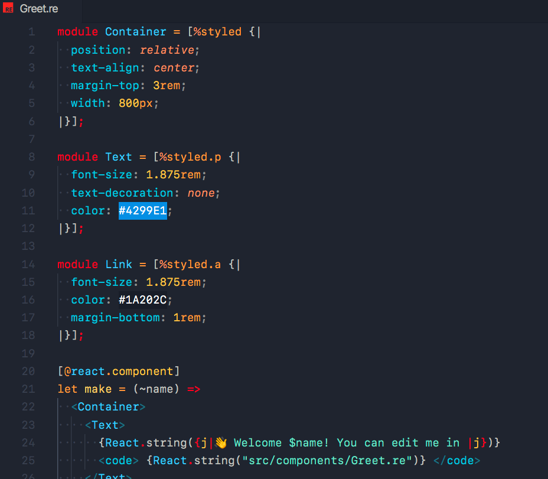

# styled-ppx

**styled-ppx** is the [ppx](https://dev.realworldocaml.org/ppx.html) that brings typed styled components to ReScript.

Build on top of [emotion](https://emotion.sh), it allows you to style apps safe, quickly, performant and as you always done it.

<p align="left">
  
</p>

Allows you to create **React Components** with type-safe style definitions that don't rely on a different [DSL](https://en.wikipedia.org/wiki/Domain-specific_language) than CSS.

## [Documentation](https://styled-ppx.vercel.app)
<!-- Add documentation index links -->
Check our website: [styled-ppx.vercel.app](https://styled-ppx.vercel.app)

### Getting started

Depends on [bs-css with bs-css-emotion](https://github.com/giraud/bs-css), [rescript-react](https://github.com/rescript-lang/rescript-react), make sure you have them installed first.

#### Install

```bash
yarn add @davesnx/styled-ppx
# Or
npm install @davesnx/styled-ppx
```

#### Update `bsconfig.json`

Add the PPX in your `bsconfig.json` file under `"ppx-flags"`

```diff
{
  "bs-dependencies": [
    "reason-react",
    "bs-css",
    "bs-css-emotion"
  ],
+  "ppx-flags": ["@davesnx/styled-ppx/ppx"]
}
```

#### Use

```rescript
module Link = %styled.a(
  (~color=Css.hex("4299E1")) => `
    font-size: 1.875rem;
    line-height: 1.5;
    text-decoration: none;
    margin: 0px;
    padding: 10px 0px;
    color: $(color);
`)

module Layout = %styled.div([
  %css("display: flex"),
  %css("width: 100%;"),
  %css("height: 100%;"),
  %css("justify-content: center;"),
  %css("align-items: center"),
])

/* Later on a component */
<Layout>
  <Link color={Css.hex("333333")} href="https://sancho.dev" rel="noopener noreferrer" />
  <span className=%cx("position: absolute; left: 0px;")>
    {React.string("sancho.dev")}
  </span>
</Layout>
```

### [Playground](https://github.com/davesnx/try-styled-ppx)

If you want to try it out, fork [github.com/davesnx/try-styled-ppx](https://github.com/davesnx/try-styled-ppx) and follow the instalation process there.

### Editor Support

One of the downsites of using a `ppx` is their editor support, we provide a VSCode and Vim extensions that bring syntax highlight. This can include in the future, CSS autocomplete and other CSS-related extensions.

Install the VSCode extension: **[VSCode Extension](https://marketplace.visualstudio.com/items?itemName=davesnx.vscode-styled-ppx)**

Install the Vim plugin: **[vim-styled-ppx plugin](https://github.com/ahrefs/vim-styled-ppx/blob/main/README.md#installation)**

> If you are interested on another editor, please [fill an issue](https://github.com/davesnx/styled-ppx/issues/new).

### Contributing

We would love your help improving **styled-ppx**. Please see our contributing and community guidelines, they'll help you get set up locally and explain the whole process: [CONTRIBUTING.md](./CONTRIBUTING.md).

### Credits

- [**Javier Chávarri**](https://github.com/jchavarri): to introduce me to Reason, teach me all his knowledge about OCaml, AST, ppx rewritters and for the help me boostrapping the project.
- [**Alessandro Strada**](https://github.com/astrada): this project started with inspiration in bs-css-ppx and forked his implementation of their CSS Parser.
- [**Eduardo Rafael**](https://github.com/EduardoRFS/): to teach me how to write a compiler and a type-checker and his implementation of the CSS Value definition and the new CSS Parser.
- [**Rizo**](https://github.com/rizo): to help with the API design, discussions and great conversations about styling and CSS.
- [**Max Lantas**](https://github.com/mnxn): to implement the VSCode extension.
- This project builds on a long line of earlier work by clever folks in the JavaScript community from around the world. People from [styled-components](https://github.com/styled-components/styled-components), [emotion](https://github.com/emotion-js/emotion), [compiledcssinjs](https://github.com/atlassian-labs/compiled), [linaria](https://github.com/callstack/linaria), and many more.

### License

TDB

---

<a href="https://github.com/davesnx/styled-ppx/actions"></a> <a href="https://badge.fury.io/js/%40davesnx%2Fstyled-ppx"></a>
