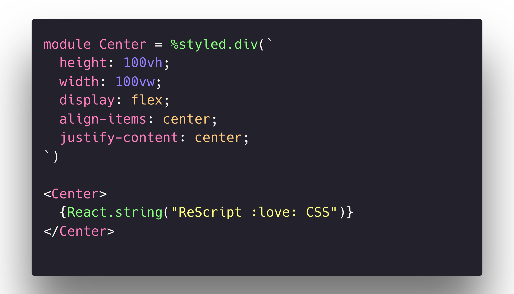

<h1 align="center">
  Typed styled components for ReScript
</h1>

**styled-ppx** is the [ppx](https://tarides.com/blog/2019-05-09-an-introduction-to-ocaml-ppx-ecosystem) that brings typed styled components to ReScript.

Build on top of [emotion](https://emotion.sh), it allows you to style apps safe, quickly, performant and as you always done it.

<a href="https://styled-ppx.vercel.app">
  <p align="center">
    
  </p>
</a>

Allows you to create **React Components** with type-safe style definitions that don't rely on a different language ([DSL](https://en.wikipedia.org/wiki/Domain-specific_language)) than CSS

## Usage

```bash
npm install @davesnx/styled-ppx
```

### Update `bsconfig.json`

Add `"@davesnx/styled-ppx/ppx"` under bsconfig `"ppx-flags"`:

```diff
{
  "bs-dependencies": [
    "@rescript/react",
    "bs-css",
    "bs-css-emotion"
  ],
+ "ppx-flags": ["@davesnx/styled-ppx/ppx"]
}
```

Read more about [getting started](https://styled-ppx.vercel.app/getting-started)

## [Documentation](https://styled-ppx.vercel.app)

For the entire documentation, visit [styled-ppx.vercel.app](https://styled-ppx.vercel.app)

### Editor Support

We provide a VSCode extension that brings syntax highlight (for now, it can include IntelliSense or other [CSS-related](https://code.visualstudio.com/docs/languages/css) features).

Install the VSCode extension: **[VSCode Extension](https://marketplace.visualstudio.com/items?itemName=davesnx.vscode-styled-ppx)**

> If you are interested on another editor, please [fill an issue](https://github.com/davesnx/styled-ppx/issues/new).

## Contributing

We would love your help improving **styled-ppx**!. Please see our contributing and community guidelines, they'll help you get set up locally and explain the whole process: [CONTRIBUTING.md](./CONTRIBUTING.md).

## License

This project is licensed under the [Simplified BSD License (BSD 2-Clause License)](./LICENSE).

## CI

<a href="https://github.com/davesnx/styled-ppx/actions"></a> <a href="https://badge.fury.io/js/%40davesnx%2Fstyled-ppx"></a>
